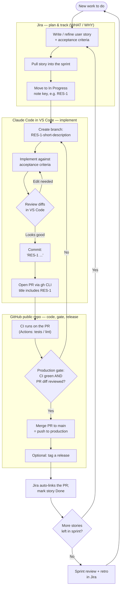

# PROCESS.md — Development Process (Source of Truth)

This document is the **canonical process** for building and maintaining this project.
It applies to the human developer **and** to any AI agent (e.g. Claude Code) working in
this repository. When in doubt, follow this document. If reality and this document
disagree, update this document in the same PR.

**Project setup:** Solo developer · Agile (Scrum) · Jira (free) + GitHub (free, public repo) + Claude Code in VS Code.

---

## 1. Tool roles

| Tool | Role | Is the source of truth for… |
|------|------|------------------------------|
| **Jira** (free plan) | Agile planning & tracking: epics, user stories, acceptance criteria, sprints, status. Lives inside a **Jira Space** (Scrum template). | *What* we build and *why* (requirements, scope, progress). |
| **GitHub** (free, **public** repo) | Version control, pull requests, the production gate (branch protection on `main`), CI (Actions), releases. | The *code* and its history. |
| **Claude Code** (in VS Code) | Implementation: creates branches, writes code against acceptance criteria, commits, opens PRs. | Nothing — it executes the process; it does not own truth. |
| **VS Code** | The human review/edit surface where diffs are inspected before anything is committed. | — |

> **Why a public repo:** On GitHub Free, branch protection, environments, and required
> checks are only available on **public** repositories. The code is generic, so it is
> safe to make public — **as long as no personal data is ever committed** (see §7).

---

## 2. Naming & conventions (AI agents MUST follow these)

The Jira issue key (e.g. `RES-1`) is the thread that ties Jira ↔ GitHub together.
It must appear in the branch name, every commit message, and the PR title so the
Jira development panel auto-links the work.

- **Branch name:** `RES-<n>-short-kebab-description` — e.g. `RES-1-master-resume-schema`
- **Commit message:** begins with the key — e.g. `RES-1 add YAML schema for master resume`
- **PR title:** includes the key — e.g. `RES-1 Master resume schema`
- **One unit of work = one story = one branch = one PR.** Do not bundle unrelated stories.
- **`main` is production.** Never commit directly to `main`; all changes arrive via a reviewed, merged PR.
- **Personal/resume data is never committed** — it lives only in gitignored paths (`data/`, `output/`).

---

## 3. Environments

There are no deployed servers. "Environments" map to Git branches:

- **Dev / testing** = feature branches (`RES-<n>-...`), run locally.
- **Production** = the `main` branch; the version you actually use. Optionally tagged as releases.

(If a hosted version is ever added, a public repo allows free GitHub Pages + a real
staging/production deploy gated by GitHub Environments — but that is out of scope until needed.)

---

## 4. One-time setup (do once, then never again)

1. **Jira:** Create a free Jira Cloud site → create a new **Jira Space** using the **Software → Scrum** template → set the space key (e.g. `RES`).
   > **Terminology note:** Atlassian renamed "Projects" to "Spaces" in late 2025. They are the same thing. Your scrum board, backlog, and sprints all live inside the Space. "Atlassian Projects" (visible in Atlassian Home) is a completely separate portfolio-level product — ignore it.
2. **GitHub Organization:** Create a **free GitHub Organization** at github.com/organizations/new (you become the owner). Create or transfer your repo there. The official GitHub for Jira app requires org-owner access; it does not work reliably with personal accounts.
3. **GitHub:** Create the **public** repo under the org. Before the first commit, add:
   - `.gitignore` excluding `data/` and `output/` (and any `*.local.*` files).
   - `CLAUDE.md` — project context + a pointer to this file.
   - This `PROCESS.md`.
4. **Connect Jira ↔ GitHub:** In Jira, go to Apps → search "GitHub for Atlassian" → install it → connect your **GitHub Organization** (not your personal account). The app requires org-owner access to function correctly. Once connected, put the Jira space key in every branch name, commit message, and PR title (e.g. `RES-1`) — this is what makes the Jira development panel auto-populate.
5. **Production gate:** On GitHub, add branch protection to `main`:
   - Require a pull request before merging.
   - Require status checks (CI) to pass before merging.
6. **CI (optional, recommended):** Add a GitHub Actions workflow that runs tests/lint on every PR.
7. **Claude Code:** Install Claude Code, open the repo in VS Code with the extension, confirm it reads `CLAUDE.md` and this file.

---

## 5. Process flow

---

## 6. The per-story loop (step by step)

For every user story, in order:

1. **[Jira]** Write or refine the story with clear **acceptance criteria**. Pull it into the active sprint and move it to **In Progress**. Note its key (e.g. `RES-1`).
2. **[Claude Code / VS Code]** Create the branch `RES-1-...`. Implement the change against the acceptance criteria.
3. **[You / VS Code]** Review the proposed diffs. Edit or send back for changes until correct. Nothing is committed until you approve it.
4. **[Claude Code]** Commit with a `RES-1 ...` message and open a PR (via `gh`) whose title includes `RES-1`.
5. **[GitHub Actions]** CI runs automatically on the PR.
6. **[You / GitHub] — PRODUCTION GATE.** Confirm CI is green and review the PR diff against the acceptance criteria. Only then **merge to `main`** (= deploy to production). Optionally tag a release.
7. **[Jira]** The issue's development panel auto-links the branch/PR. Verify acceptance criteria are met and move the story to **Done**.
8. Repeat for the next story. At sprint end, run a **review + retro** in Jira.

---

## 7. Guardrails (hard rules — never violate)

- **Never commit personal data.** Resume content, generated resumes, and any PII stay in gitignored paths only.
- **Never push directly to `main`.** Every change goes through a PR.
- **Never merge a PR with failing CI** or an unreviewed diff.
- **Never bundle multiple stories** into one branch/PR.
- **Always carry the Jira key** through branch, commits, and PR title.

---

## 8. Definition of Done

A story is Done only when **all** of the following are true:

- [ ] All acceptance criteria in the Jira story are met.
- [ ] Code is on a `RES-<n>-...` branch with a PR titled with the key.
- [ ] CI is green.
- [ ] The PR diff has been reviewed and merged to `main`.
- [ ] No personal data was committed.
- [ ] The Jira story is moved to Done.
